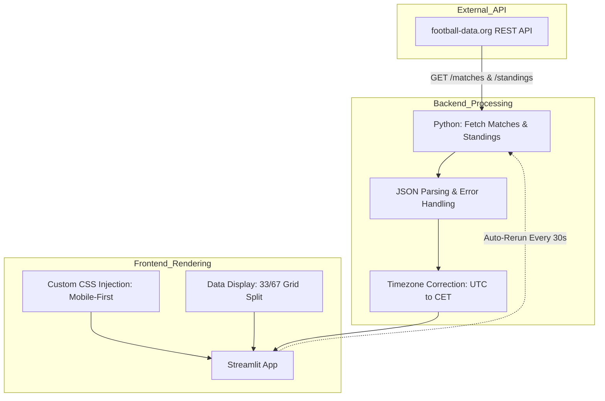
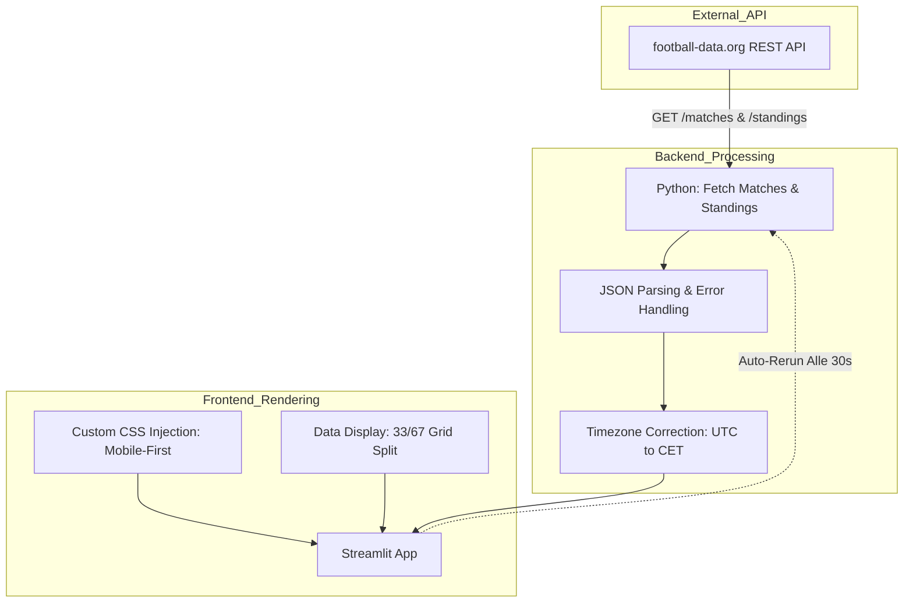

# ⚽ Champions League Real-Time Dashboard | API Integration
**A lightweight, mobile-optimized data visualization tool demonstrating real-time API polling and custom frontend constraints using Streamlit.**

## 📊 Architecture & Data Flow
This diagram visualizes the real-time data ingestion and rendering loop.


---

## 📋 Overview
While primarily a passion project, this dashboard serves as a technical Proof of Concept (PoC) for handling real-time data streams and overriding standard framework behaviors. It transforms raw JSON feeds into a highly customized, mobile-first interface, bypassing Streamlit's default responsive grid to force a strict layout for specific devices (e.g., Samsung S24 Ultra).

## 🛠 Technical Implementation
*   **Real-Time Data Ingestion:** Scheduled API polling (every 30s) fetching live match events (goals, cards, substitutions) and current group standings.
*   **Frontend Engineering:** Strategic injection of raw CSS (`unsafe_allow_html`) to enforce a `no-wrap` flexbox layout, ensuring a persistent 33/67 column split on mobile screens.
*   **Data Normalization:** Automated parsing of nested JSON structures and localized timezone adjustments (`UTC` to `CET`).
*   **Resilience:** Built-in error handling for API timeouts and missing data payloads to prevent application crashes during live matches.

## ⚙️ Tech Stack
*   **Framework:** Streamlit (Python 3)
*   **Data Source:** football-data.org REST API
*   **Libraries:** `requests`, `datetime`, `time`, `os`
*   **Styling:** Custom CSS / HTML

## 🚀 Setup Instructions
1.  **Get a free API key:** Register at [football-data.org](https://www.football-data.org/client/register) (free tier covers Champions League data).
2.  **Install dependencies:**
    ```bash
    pip install streamlit==1.31.0 requests==2.31.0
    ```
3.  **Set Environment Variable:** Never hardcode your API key.
    ```bash
    export FOOTBALL_API_KEY=your_key_here
    ```
4.  **Run the App:**
    ```bash
    streamlit run streamlit_app.py
    ```

---
<br>

# ⚽ Champions League Real-Time Dashboard | API Integration (DE)
**Ein leichtgewichtiges, mobil-optimiertes Datenvisualisierungs-Tool, das Echtzeit-API-Abfragen und maßgeschneiderte Frontend-Anpassungen mit Streamlit demonstriert.**

## 📊 Architektur & Datenfluss
Dieses Diagramm visualisiert den Echtzeit-Datenabruf und die Rendering-Schleife.


---

## 📋 Überblick
Obwohl es primär ein Leidenschaftsprojekt ist, dient dieses Dashboard als technischer Proof of Concept (PoC) für den Umgang mit Echtzeit-Datenströmen und das Überschreiben von Standard-Framework-Verhalten. Es transformiert rohe JSON-Feeds in ein hochgradig angepasstes, Mobile-First-Interface und umgeht das standardmäßige responsive Grid von Streamlit, um ein festes Layout für spezifische Endgeräte (z.B. Samsung S24 Ultra) zu erzwingen.

## 🛠 Technische Umsetzung
*   **Echtzeit-Datenaufnahme:** Geplantes API-Polling (alle 30s) zum Abruf von Live-Spielereignissen (Tore, Karten, Auswechslungen) und aktuellen Tabellenständen.
*   **Frontend Engineering:** Strategische Injektion von nativem CSS (`unsafe_allow_html`), um ein `no-wrap` Flexbox-Layout zu erzwingen und eine feste 33/67-Spaltenaufteilung auf mobilen Bildschirmen zu garantieren.
*   **Daten-Normalisierung:** Automatisiertes Parsing verschachtelter JSON-Strukturen und lokalisierte Zeitzonenanpassungen (`UTC` zu `CET`).
*   **Ausfallsicherheit:** Integriertes Error-Handling für API-Timeouts und fehlende Daten-Payloads, um App-Abstürze während Live-Spielen zu verhindern.

## ⚙️ Tech Stack
*   **Framework:** Streamlit (Python 3)
*   **Datenquelle:** football-data.org REST API
*   **Bibliotheken:** `requests`, `datetime`, `time`, `os`
*   **Styling:** Custom CSS / HTML

## 🚀 Setup-Anleitung
1.  **Kostenlosen API-Key erstellen:** Registrierung unter [football-data.org](https://www.football-data.org/client/register) (Free-Tier deckt Champions League Daten ab).
2.  **Abhängigkeiten installieren:**
    ```bash
    pip install streamlit==1.31.0 requests==2.31.0
    ```
3.  **Umgebungsvariable setzen:** Der API-Key darf niemals hart in den Code geschrieben werden.
    ```bash
    export FOOTBALL_API_KEY=your_key_here
    ```
4.  **App starten:**
    ```bash
    streamlit run streamlit_app.py
    ```
